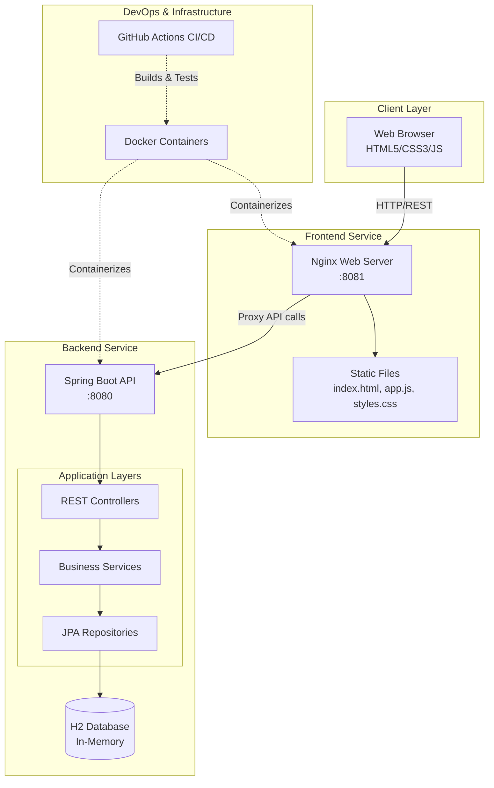
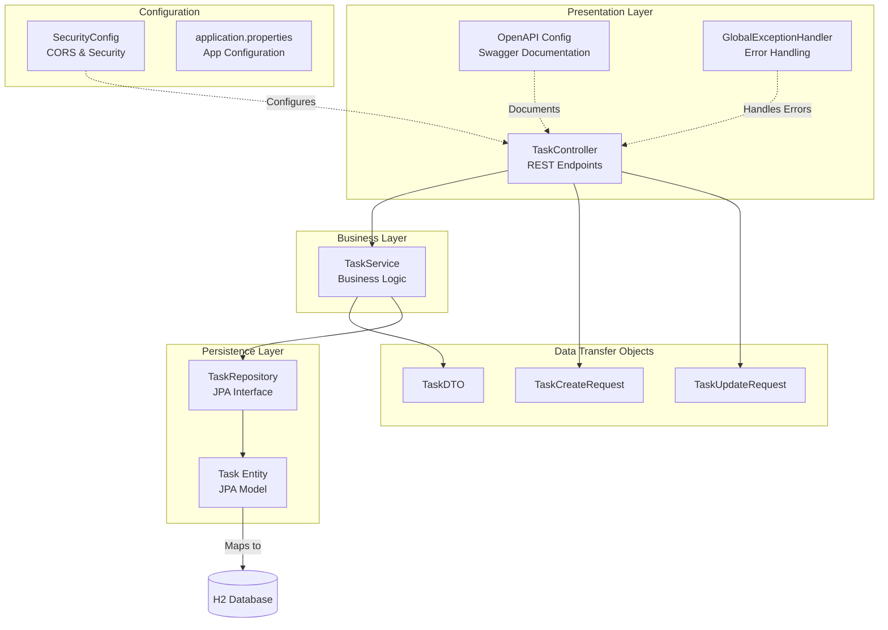
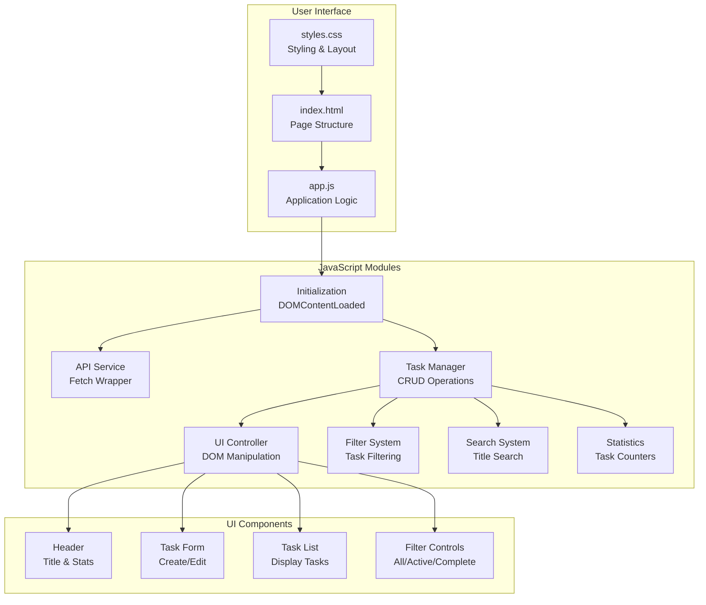
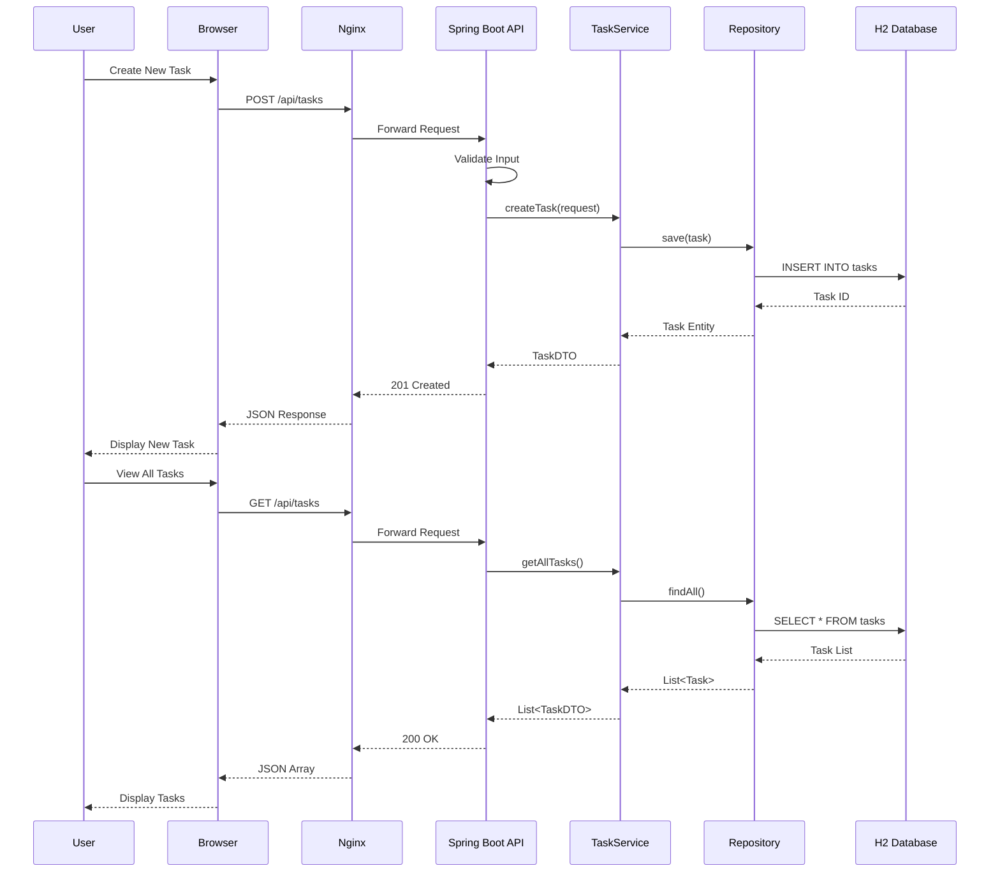
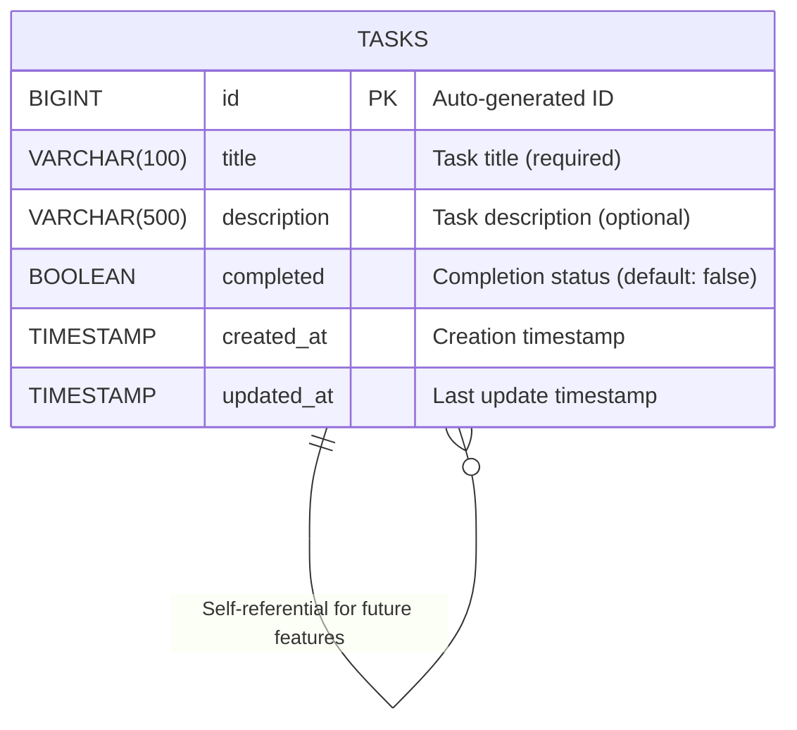
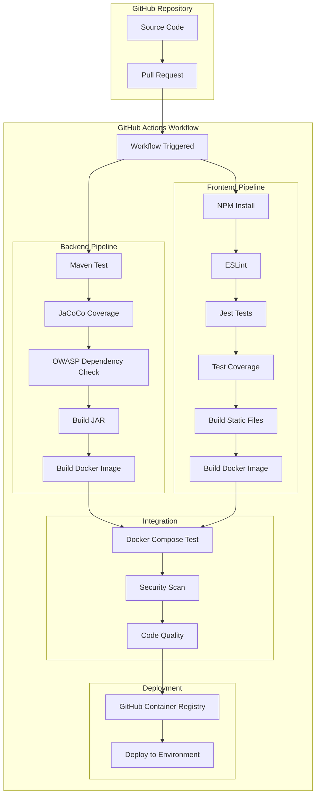
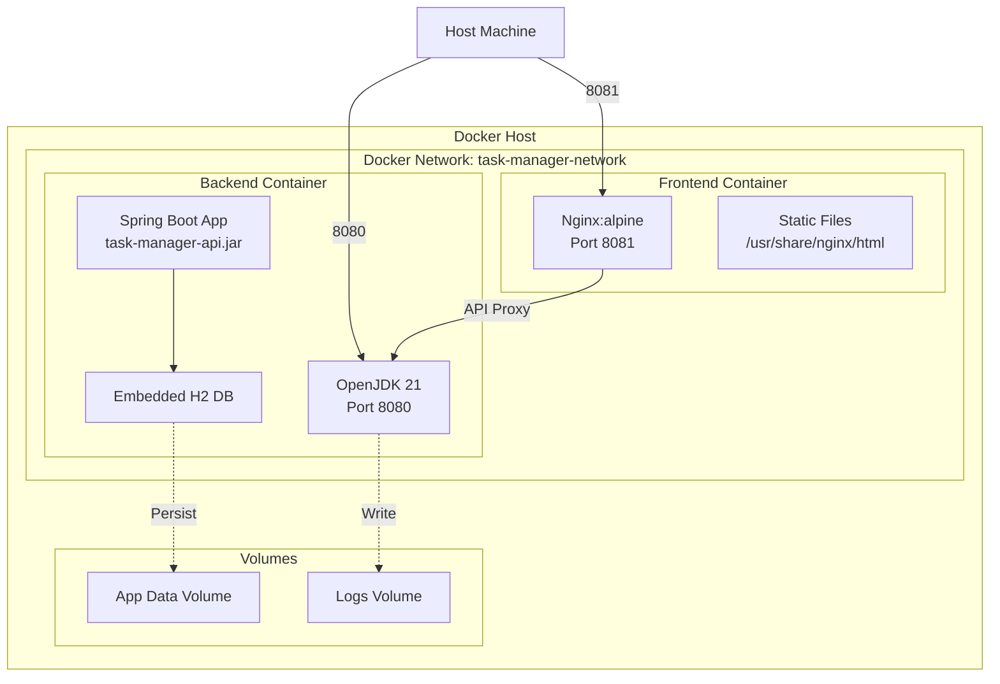
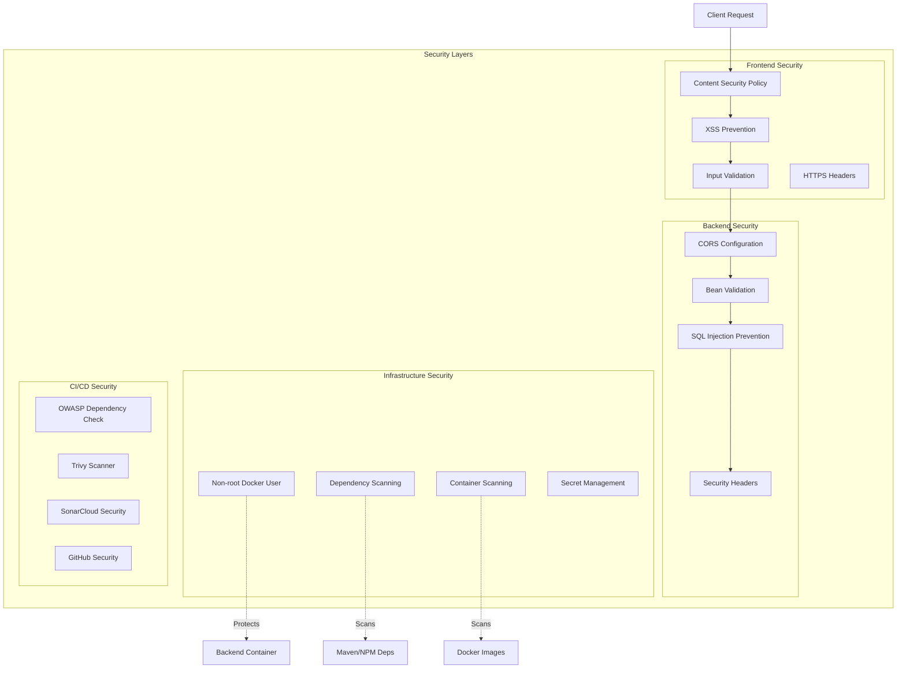
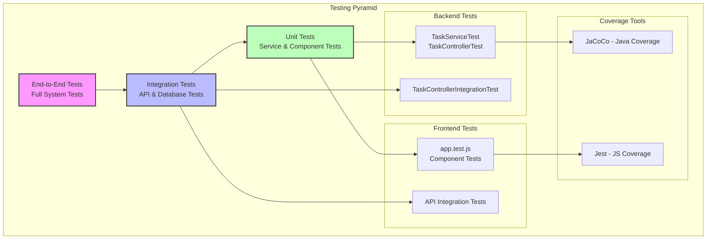

# Task Manager V2 - Architecture Diagrams

## 1. System Architecture Overview



## 2. Backend Architecture - Layered Design



## 3. Frontend Architecture - Component Structure



## 4. Data Flow Diagram



## 5. API Endpoints Structure

```mermaid
graph LR
    subgraph "Task Management APIs"
        Root[/api/tasks]
        
        Root --> GET_ALL[GET /<br/>Get all tasks]
        Root --> GET_ID[GET /{id}<br/>Get task by ID]
        Root --> POST[POST /<br/>Create task]
        Root --> PUT[PUT /{id}<br/>Update task]
        Root --> DELETE[DELETE /{id}<br/>Delete task]
        
        Root --> COMPLETE[PUT /{id}/complete<br/>Mark complete]
        Root --> INCOMPLETE[PUT /{id}/incomplete<br/>Mark incomplete]
        
        Root --> FILTER_COMP[GET /completed<br/>Get completed]
        Root --> FILTER_INCOMP[GET /incomplete<br/>Get incomplete]
        Root --> SEARCH[GET /search?title=<br/>Search by title]
        Root --> STATS[GET /statistics<br/>Get statistics]
    end
    
    subgraph "System APIs"
        Health[/api/actuator/health<br/>Health Check]
        Metrics[/api/actuator/metrics<br/>App Metrics]
        Swagger[/api/swagger-ui.html<br/>API Docs]
        H2[/api/h2-console<br/>Database Console]
    end
```

## 6. Database Schema



## 7. CI/CD Pipeline Flow



## 8. Docker Container Architecture



## 9. Security Architecture



## 10. Testing Strategy Pyramid



## Key Architecture Decisions

### 1. **Modular Design**
- Separate frontend and backend services for independent scaling
- Clear separation of concerns with layered architecture
- RESTful API design for frontend-backend communication

### 2. **Technology Choices**
- **Spring Boot**: Mature, enterprise-ready framework with excellent ecosystem
- **H2 Database**: Lightweight, embedded database perfect for development
- **Vanilla JavaScript**: No framework dependencies, lighter footprint
- **Docker**: Consistent deployment across environments
- **GitHub Actions**: Native CI/CD integration with repository

### 3. **Security First**
- Multiple security layers from frontend to infrastructure
- Automated security scanning in CI/CD pipeline
- Regular dependency updates and vulnerability checks

### 4. **Testing Strategy**
- Comprehensive test coverage at all levels
- Automated testing in CI/CD pipeline
- Both unit and integration tests for confidence

### 5. **Observability**
- Health checks and metrics endpoints
- Structured logging with correlation IDs
- Performance monitoring capabilities

## How to Read These Diagrams

1. **System Architecture Overview**: Shows the high-level components and their relationships
2. **Backend Architecture**: Details the Spring Boot application structure
3. **Frontend Architecture**: Shows the vanilla JavaScript application organization
4. **Data Flow**: Illustrates how a request flows through the system
5. **API Endpoints**: Maps out all available REST endpoints
6. **Database Schema**: Shows the data model structure
7. **CI/CD Pipeline**: Visualizes the automated build and deployment process
8. **Docker Architecture**: Shows containerization structure
9. **Security Architecture**: Illustrates security layers and measures
10. **Testing Pyramid**: Shows testing strategy and coverage

These diagrams use Mermaid syntax and can be rendered in any Markdown viewer that supports Mermaid diagrams (GitHub, GitLab, VS Code with extensions, etc.).
